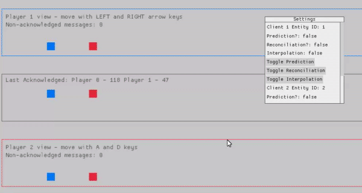

### Client Server Netcode Example

A replication of the demo provided in Gabriel Gambetta's [Fast-Paced Multiplayer Series](https://www.gabrielgambetta.com/client-server-game-architecture.html) built in rust that allows for:

- Client Side Prediction
- Server Reconciliation
- Entity Interpolation

Try the demo [here](https://fliqqs.github.io/client-side-prediction-rust/)

Run with

`cargo build`

`build/target/netcode_example`