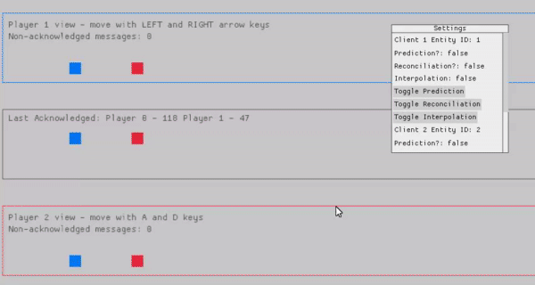

### Client Server Netcode Example



A replication of the demo provided in Gabriel Gambetta's [Fast-Paced Multiplayer Series](https://www.gabrielgambetta.com/client-server-game-architecture.html) built in rust that allows for:

- Client Side Prediction
- Server Reconciliation
- Entity Interpolation

Try the demo [here](https://fliqqs.github.io/client-side-prediction-rust/)

## Development

### Building the WASM module

First, build the Rust WASM module:

```bash
cargo build --release --target wasm32-unknown-unknown
cp target/wasm32-unknown-unknown/release/netcode_example.wasm public/
```

Or use the npm script from the web directory:

```bash
cd web
npm run build:wasm
```

### Running the React web app

Navigate to the web directory and install dependencies:

```bash
cd web
npm install
```

Start the development server:

```bash
npm run dev
```

Build for production:

```bash
npm run build
```

## Running the native version

To run the native desktop version:

```bash
cargo build
./target/debug/netcode_example
```